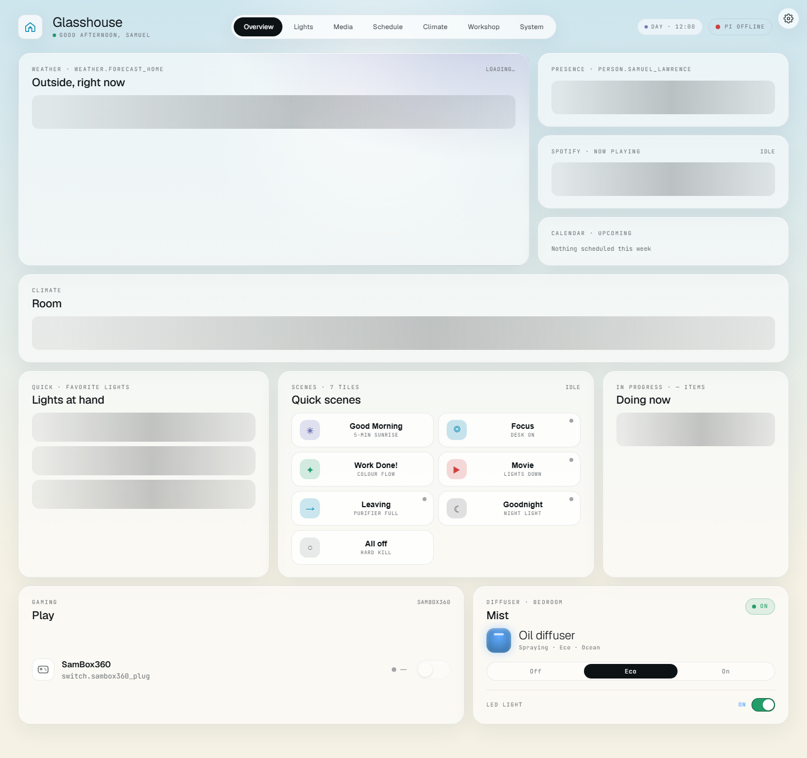
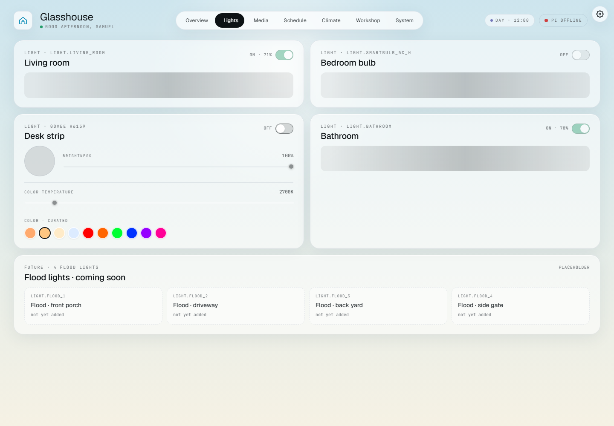
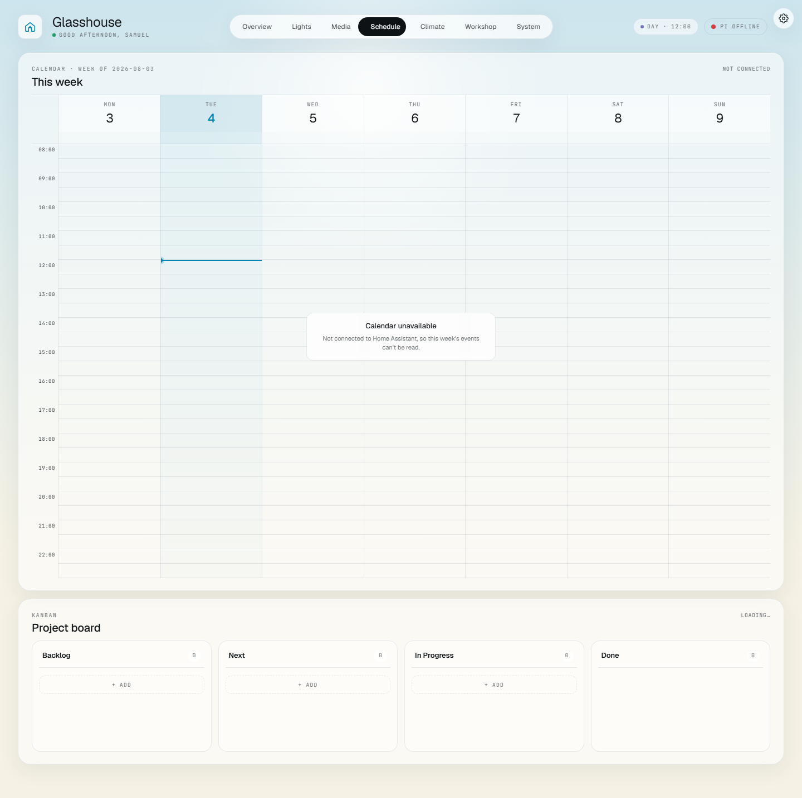
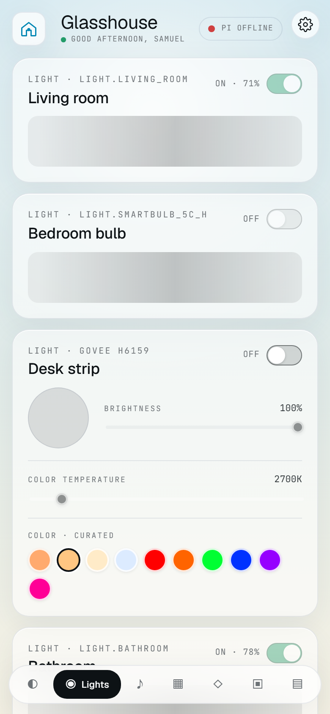

# Glasshouse

Glasshouse is a custom front end for [Home Assistant](https://www.home-assistant.io/) — a React
dashboard for one real house, replacing Home Assistant's built-in Lovelace UI. It runs as a static
site and talks to Home Assistant directly from the browser over a WebSocket, so the whole thing is
a bundle of HTML and JavaScript with no server of its own.

The design rule the codebase is built around: **it never shows a number it isn't sure of.** A
sensor that has gone quiet renders an em-dash. A week the calendar couldn't be read says so
instead of filling itself in. That sounds obvious; getting there took an audit that found 52
defects, most of which were exactly this failure.

---

## What it looks like

The shots below are from a **mock-mode build** — `VITE_HA_URL` empty, no Home Assistant connected,
no real house state on screen. That is also why several cards show their loading skeleton or an
explicit "unavailable": with nothing to read, that is what they are supposed to do. Connected to a
real instance, those fill in.

### Overview — desktop

Weather, presence, what's playing, this week, the room, favourite lights, scenes, the console plug
and the diffuser, all on one screen.



### Lights — desktop

One card per light. Brightness, colour temperature and a curated colour set for the bulbs that
support them; a visibly labelled "coming soon / not yet added" block for the four flood lights that
have no Home Assistant entity yet.



### Schedule — desktop, with no connection

The honest-failure case, and the reason it's here. The week grid still renders at full size, the
current-time line is still drawn, and the card says *"Calendar unavailable — not connected to Home
Assistant, so this week's events can't be read."* It does not invent a week.



### Lights — phone

Same cards, one column, a bottom tab bar. 390&nbsp;px wide.



---

## How it fits together

There are **two independent network paths**, and this is the part worth understanding:

```
[browser, anywhere]
  │
  ├─ 1. loads the app
  │       ↓ HTTPS
  │     [CloudFront edge] → [S3 bucket]        ← static React bundle
  │
  └─ 2. then talks to Home Assistant itself, directly — no AWS in this path
          ↓ HTTPS + WSS
        [Tailscale Funnel ingress]
          ↓
        [Home Assistant OS on a Raspberry Pi 4]
```

AWS serves the files and then gets out of the way. Every entity read, every service call and the
whole live WebSocket stream go browser → Funnel → Pi. Nothing about your house passes through
CloudFront.

That split is deliberate. An earlier version proxied Home Assistant through a second CloudFront
distribution so the browser only ever touched one domain. CloudFront bills per request and a live
dashboard is chatty, so it cost real money for a cosmetic benefit. The proxy was retired; the
trade-off accepted in exchange is that the Funnel hostname is visible in DNS and SNI, and that the
dashboard and Home Assistant are now different origins — so Home Assistant's `http:` block has to
list the dashboard origin in `cors_allowed_origins`.

**Auth** is Home Assistant's own OAuth indirect grant, via
[`home-assistant-js-websocket`](https://github.com/home-assistant/home-assistant-js-websocket).
First visit redirects to Home Assistant's login, comes back with a code, and the library exchanges
and stores tokens in `localStorage`, refreshing them itself. **No credential is ever built into the
bundle** — the only two build-time values are a base URL and a Spotify client id that is public by
design (the Spotify flow is PKCE, so there is no secret to leak).

---

## Running it locally

Node 22 — that's what CI runs. There's no `engines` pin, so older versions may well work; they
just aren't tested.

```bash
npm install
cp .env.example .env.local     # then edit .env.local
npm run dev                    # http://localhost:5173
```

You need a reachable Home Assistant instance and a user account on it. On first load the app will
bounce you to that instance's login page and back.

**Or run it with no Home Assistant at all.** Leave `VITE_HA_URL` empty and the app falls back to
the fixture data in `src/data.js` — that is what the screenshots above are, and what the automated
visual checks run against:

```bash
VITE_HA_URL="" npm run build && npm run preview
```

### Environment variables

Both are read at **build** time and baked into the bundle, so changing either means rebuilding.
Names only — see `.env.example` for the shape.

| Variable | Required | What it is |
|---|---|---|
| `VITE_HA_URL` | for live mode | Base URL of the Home Assistant instance. Empty string selects mock mode. |
| `VITE_SPOTIFY_CLIENT_ID` | optional | Spotify Web API client id, used by search / playlists / queue on the Media tab. Public by design — the app uses PKCE, so there is no client secret. Leave it empty and those cards say "connect to Spotify to use this card" instead of pretending. |

There is deliberately **no token variable.** A long-lived Home Assistant token in a `.env` file
never expires, sits in plaintext on disk and in every backup, and bypasses both OAuth and the
role gating in `src/lib/roles.js`. Nothing in this codebase reads one. Don't add one back.

---

## The checks

Four gates, cheapest first. CI runs them in this order, on branches, on pull requests **and** on
the deploy — pushing to `main` is the normal flow here, so the deploy can't rely on someone having
opened a PR.

| | Command | Catches |
|---|---|---|
| 1 | `npm run lint` | undefined identifiers — the typo that builds cleanly and blanks one lazily-loaded tab in production |
| 2 | `npm test` | date maths, optimistic on/off, the role rules, the calendar range, the sky palette |
| 3 | `node scripts/console-check.mjs <dist>` | anything that throws when a tab is opened |
| 4 | `node scripts/visual-check.mjs` | a screen that changed shape without anyone meaning it to |

Gates 3 and 4 need a browser: `npx playwright install --with-deps chromium`.

Gate 4 screenshots 7 tabs × 2 viewports from a mock-mode build with animations frozen, and
pixel-diffs them against `visual-baseline/`. When a change is *meant* to move pixels:

```bash
node scripts/visual-check.mjs --bless    # then look at the PNGs and commit visual-baseline/
```

Screenshots are only comparable when the same renderer took both, so a baseline is stamped with the
platform that shot it and `pixel-diff.mjs` refuses to compare across platforms.

That is why the committed baseline is shot on a **runner** rather than on a developer's machine —
it has to come from the same platform that will compare against it:

```bash
gh workflow run ci.yml -f bless=true
gh run download <run-id> -n visual-baseline -D visual-baseline
git add visual-baseline && git commit -m "chore: bless visual baseline on linux"
```

A local `--bless` updates the baseline for *your* machine, which CI will then decline to compare
against — so use it to look at diffs, and the command above to actually move the gate.
[`scripts/README.md`](scripts/README.md) explains why CI deliberately doesn't commit a new
baseline by itself.

---

## Deploying

Push to `main`. GitHub Actions runs lint → test → console gate → screenshot gate → build, then
assumes an AWS role via OIDC (no static keys), syncs `dist/` to S3 and invalidates CloudFront. All
of them run before the first AWS call, and **all four block**.

The bucket and distribution ids are **not** stored in this repo. They're read out of the
CloudFormation stack at deploy time, because a copied-out id survives the resource being replaced:
the workflow would keep uploading to the old bucket, go green, and the live site would silently stop
updating.

Only `dist/assets/*` is content-hashed, so only that is cached as immutable. `index.html`,
`icon.svg` and `manifest.webmanifest` keep stable names, get a short cache and are invalidated on
every deploy — an `immutable` app icon can't be replaced for a year.

The S3 bucket, CloudFront distribution, certificate and DNS are all defined as AWS CDK in a
separate backend repo. Nothing here is click-opped in the AWS console.

---

## Layout

```
src/
├── App.jsx          tab shell, theme orchestration, routing; views are lazily loaded
├── theme.js         the sky palette — real sunrise/sunset from Home Assistant's sun.sun
├── views/           one file per tab. Composition only: no entity logic
├── cards/<tab>/     one exported card per file, grouped by tab
├── components/      entity-agnostic primitives. Must not import ha/ or data.js
├── hooks/           shared logic, no JSX, one hook per file
├── lib/             pure helpers — formatting, URL parsing, the role map, the error log
├── styles/          CSS slices + an index.css manifest. Import order is a contract
├── ha/              the Home Assistant layer: socket, REST client, React hooks, Spotify
└── data.js          fixture data — the pre-connection fallback and mock mode
scripts/             the console and screenshot gates
tests/               vitest, jsdom, no network
```

Full conventions, the rule each directory has to keep, and a per-file audit of what is live versus
what is fixture data live in **`CLAUDE.md`** — the cold-start brief for anyone (or anything)
opening this codebase. It sits in the working directory *above* this repo, alongside `LESSONS.md`
and `ROADMAP.md`, and is not checked in: it describes a specific house and a specific pair of AWS
accounts, so it is kept out of a repo that is meant to be readable by strangers. Read it first if
you have it.

---

## Status

A personal project running a real house, not a product. It has no licence file yet, so treat it as
all-rights-reserved for now; open-sourcing it properly is a tracked piece of work.
